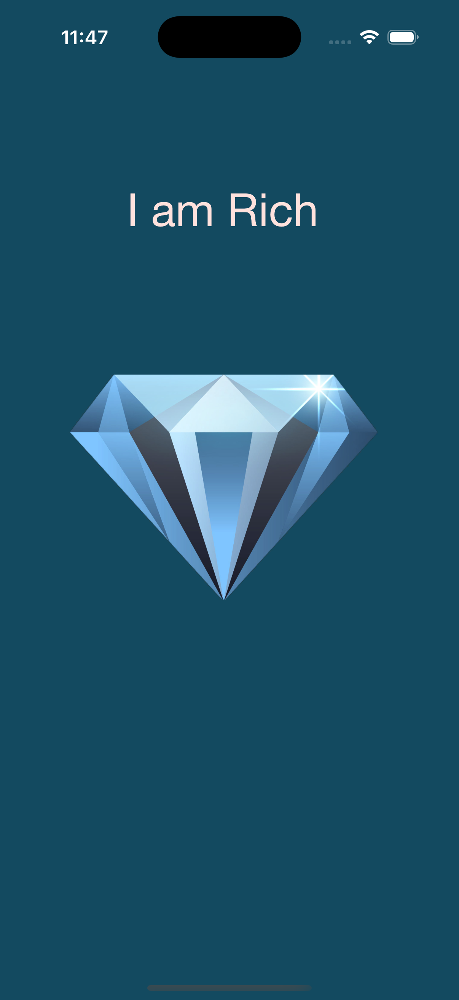

# I Am Rich - iOS App

A simple iOS application that displays a diamond image with the text "I am Rich" - inspired by the famous $999.99 app that was available on the App Store.

## Screenshots

## Features

- Clean, minimalist design with a diamond image
- "I am Rich" text display
- Dark blue background with elegant typography
- Simple single-screen interface

## Technical Details

- **Platform**: iOS 13+
- **Language**: Swift
- **Framework**: UIKit
- **Architecture**: Storyboard-based UI
- **Target**: iPhone

## Setup Instructions

1. Open `I am rich.xcodeproj` in Xcode
2. Select your target device or simulator
3. Build and run the project (⌘+R)

## Requirements

- Xcode 12.0 or later
- iOS 13.0 or later
- Swift 5.0 or later

## About

This project is part of a Udemy iOS development course. It demonstrates basic iOS app structure, storyboard usage, and asset management in Xcode.

## Author

Created by Ahmet Büyükçelik as part of iOS development learning journey.

---

*This app is for educational purposes only.*
