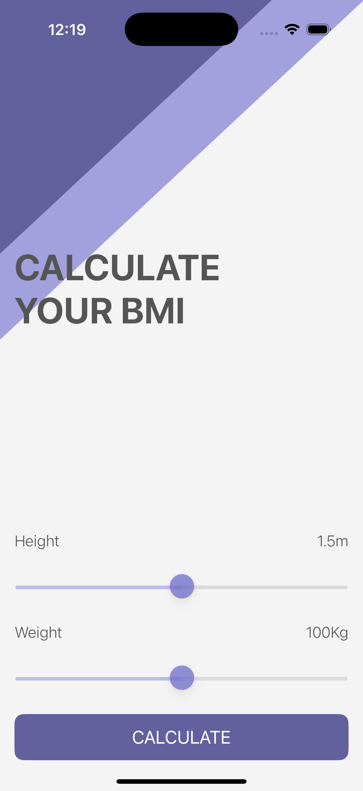
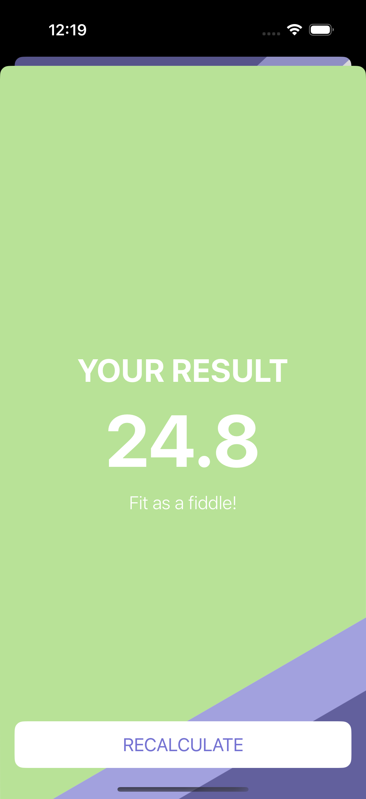

# BMI Calculator - iOS Health App

A professional iOS BMI (Body Mass Index) calculator application that helps you track your health and fitness. Input your height and weight using interactive sliders, then view your BMI result with personalized advice and color-coded health recommendations.

## Screenshots

## Features

- **Interactive Sliders**: Easy height (0-3m) and weight (0-200kg) input
- **Real-time Updates**: Live display of current values as you adjust sliders
- **BMI Calculation**: Automatic BMI computation using standard formula
- **Health Categories**: Color-coded results (Underweight, Normal, Overweight)
- **Personalized Advice**: Custom recommendations based on your BMI
- **Two-Screen Design**: Input screen and results screen
- **Beautiful UI**: Modern design with custom backgrounds and styling
- **MVC Architecture**: Clean separation of calculation logic and presentation

## How It Works

1. **Adjust Sliders**: Move height and weight sliders to set your values
2. **View Live Updates**: See current values update in real-time
3. **Calculate BMI**: Tap "CALCULATE" button to compute your BMI
4. **View Results**: See your BMI score, category, and personalized advice
5. **Recalculate**: Tap "RECALCULATE" to return to input screen

## Technical Details

- **Platform**: iOS 13+
- **Language**: Swift
- **Framework**: UIKit
- **Architecture**: MVC (Model-View-Controller)
- **Navigation**: Segue-based screen transitions
- **Layout System**: AutoLayout with Stack Views
- **Target**: iPhone (Portrait orientation)

## Setup Instructions

1. Open `BMI Calculator.xcodeproj` in Xcode
2. Select your target device or simulator
3. Build and run the project (⌘+R)
4. Adjust sliders and calculate your BMI!

## Requirements

- Xcode 12.0 or later
- iOS 13.0 or later
- Swift 5.0 or later

## About

This project is part of a Udemy iOS development course. It demonstrates:
- Multi-screen app navigation with segues
- Interactive UI controls (sliders)
- Mathematical calculations and data processing
- Color-coded UI feedback
- MVC architecture with data models
- Professional app design patterns

## Author

Created by Ahmet Büyükçelik as part of iOS development learning journey.

---

*Track your health with this BMI calculator! 📊💪*
