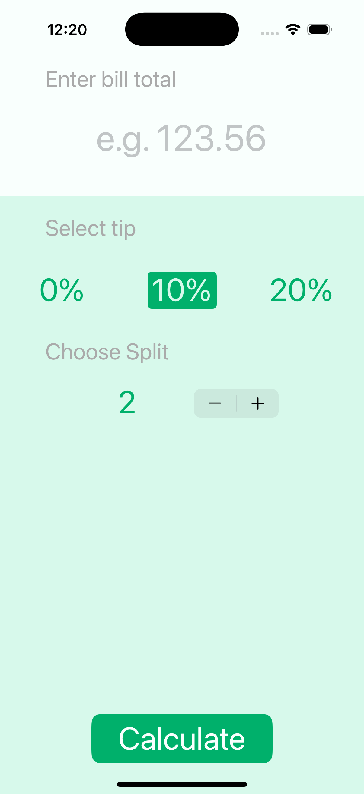
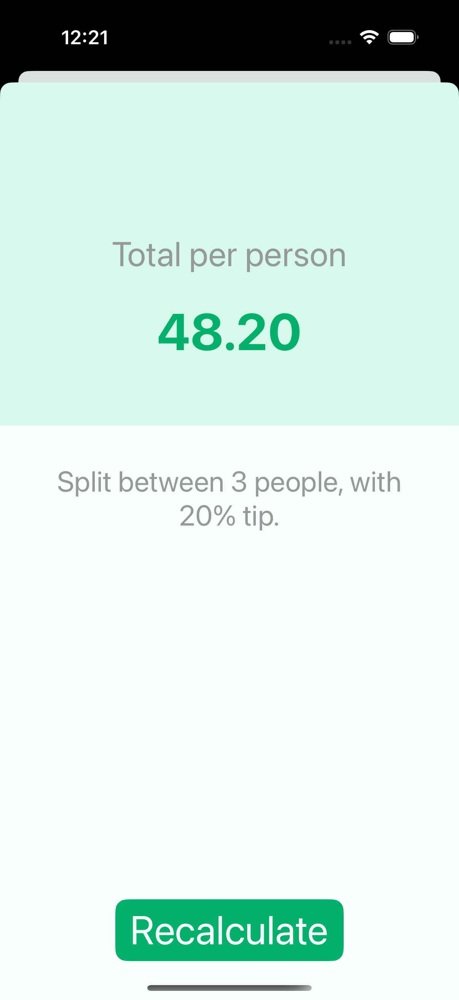

# Tipsy - iOS Tip Calculator App

A practical iOS tip calculator application that helps you split restaurant bills and calculate tips easily. Enter your bill amount, select tip percentage, choose how many people to split between, and get the exact amount each person should pay.

## Screenshots

## Features

- **Bill Input**: Enter bill amount with decimal pad keyboard
- **Tip Selection**: Choose from 0%, 10%, or 20% tip options
- **Split Control**: Stepper to select number of people (2-25)
- **Real-time Calculation**: Automatic calculation with tip included
- **Two-Screen Design**: Input screen and results screen
- **Detailed Results**: Shows total per person and calculation details
- **Beautiful UI**: Clean design with green color scheme
- **Easy Navigation**: Simple segue-based screen transitions

## How It Works

1. **Enter Bill**: Type the total bill amount in the text field
2. **Select Tip**: Tap 0%, 10%, or 20% tip button
3. **Choose Split**: Use stepper to select number of people
4. **Calculate**: Tap "Calculate" to see results
5. **View Results**: See total per person and calculation details
6. **Recalculate**: Tap "Recalculate" to return to input screen

## Technical Details

- **Platform**: iOS 13+
- **Language**: Swift
- **Framework**: UIKit
- **Architecture**: Two-screen app with segues
- **Input Validation**: Handles decimal input and error cases
- **Layout System**: AutoLayout with Stack Views
- **Target**: iPhone (Portrait orientation)

## Setup Instructions

1. Open `Tipsy.xcodeproj` in Xcode
2. Select your target device or simulator
3. Build and run the project (⌘+R)
4. Calculate your tips and split bills easily!

## Requirements

- Xcode 12.0 or later
- iOS 13.0 or later
- Swift 5.0 or later

## About

This project is part of a Udemy iOS development course. It demonstrates:
- Text field input handling and validation
- Button selection states and UI updates
- Stepper control usage
- Mathematical calculations
- Segue-based navigation
- Data passing between view controllers
- Professional app design

## Author

Created by Ahmet Büyükçelik as part of iOS development learning journey.

---

*Split bills and calculate tips effortlessly! 💰🍽️*
