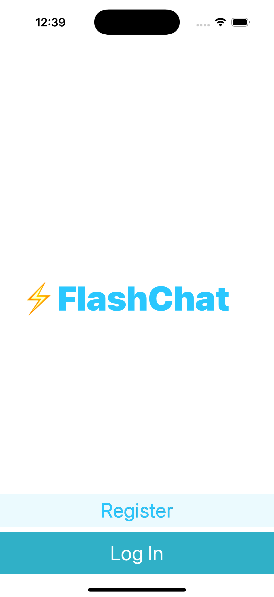
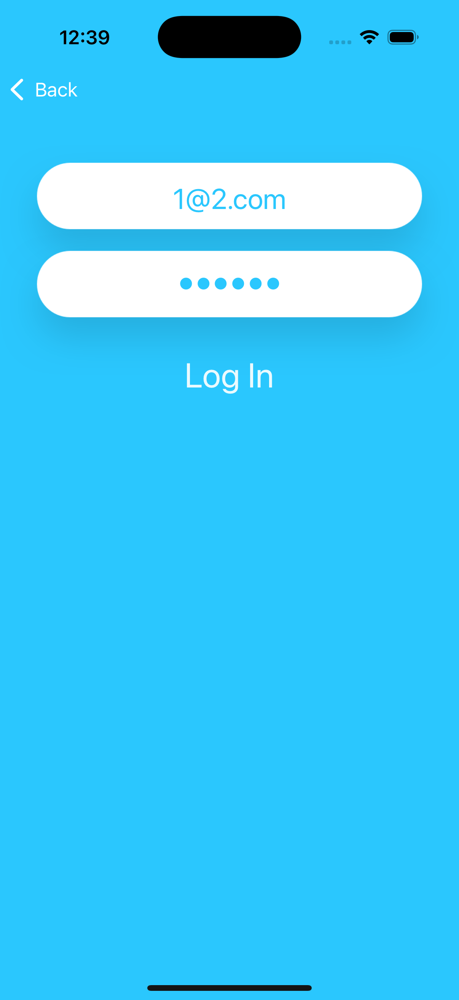
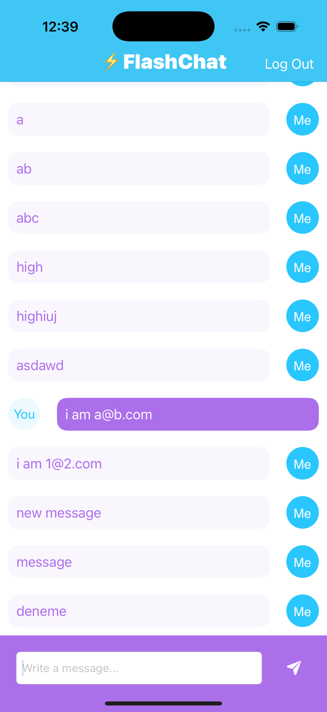

# Flash Chat - iOS Messaging App

A simple and modern iOS chat application that enables real-time messaging using Firebase. Includes email/password authentication, live message updates with Firestore, and a clean UI with custom message cells.

## Screenshots

## Features

- **Email Authentication**: Secure sign up and login with email/password
- **Real-time Messaging**: Live updates powered by Firebase Firestore
- **Custom UI**: Polished chat interface and reusable message cells
- **Keyboard Management**: Smooth input experience with IQKeyboardManager

## How It Works

1. **Register or Login**: Create an account or sign in with email/password
2. **Enter Chat**: Navigate to the chat screen after authentication
3. **Send Messages**: Type and send messages; they appear instantly for all users
4. **Logout**: Safely sign out and return to the welcome screen

## Technical Details

- **Platform**: iOS 13+
- **Language**: Swift
- **Framework**: UIKit
- **Architecture**: MVC with view controllers and custom cells
- **Backend**: Firebase Auth + Firebase Firestore
- **Dependencies**: CocoaPods (Pods folder included)
- **Target**: iPhone (Portrait orientation)

## Setup Instructions

1. **Install Pods**: Run `pod install` inside `13- Flash-Chat-iOS13/`
2. **Open Workspace**: Open `Flash Chat iOS13.xcworkspace` in Xcode
3. Select your target device or simulator
4. Build and run the project (⌘+R)

## Firebase Configuration

**Important**: Before running the app, you need to:
1. Create a Firebase project and add an iOS app (use your bundle ID)
2. Download `GoogleService-Info.plist` from Firebase Console
3. Add the plist to `Flash Chat iOS13/` and ensure it’s in the app target

## Requirements

- Xcode 12.0 or later
- iOS 13.0 or later
- Swift 5.0 or later
- Firebase project with Auth and Firestore enabled

## About

This project is part of a Udemy iOS development course. It demonstrates:
- Firebase Auth and Firestore real-time integration
- Clean MVC organization and custom reusable cells
- Third-party keyboard handling (IQKeyboardManager)
- CocoaPods dependency management

## Author

Created by Ahmet Büyükçelik as part of iOS development learning journey.

---

*Chat in real-time with a clean and simple UI! 💬✨*
