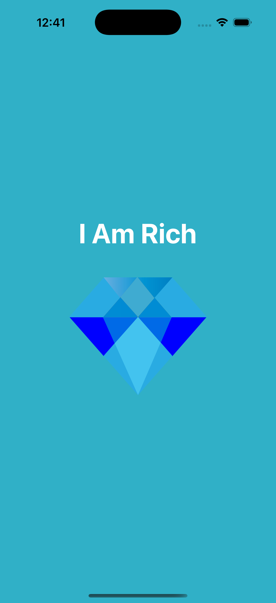

# I Am Rich - iOS SwiftUI App

A minimal SwiftUI application inspired by the classic "I Am Rich" app. Displays a luxury gem icon and elegant typography on a clean background to demonstrate SwiftUI basics and asset handling.

## Screenshots

## Features

- **SwiftUI Interface**: Built entirely with SwiftUI
- **Clean Typography**: Large, elegant title text
- **Asset Management**: Uses app icon and image assets
- **Dark/Light Ready**: Simple design that looks great in both modes
- **Single Screen**: Focused, minimal example app

## How It Works

1. **Launch App**: The main view renders via `I_Am_RichApp`
2. **Display Content**: `ContentView` shows the title and gem image
3. **Static UI**: No navigation or interactions; purely visual
4. **SwiftUI Preview**: Live previews supported in Xcode

## Technical Details

- **Platform**: iOS 13+
- **Language**: Swift
- **Framework**: SwiftUI
- **Architecture**: App lifecycle with `@main` and `Scene`
- **Target**: iPhone (Portrait orientation)

## Setup Instructions

1. Open `I Am Rich.xcodeproj` in Xcode
2. Select your target device or simulator
3. Build and run the project (⌘+R)

## Requirements

- Xcode 12.0 or later
- iOS 13.0 or later
- Swift 5.0 or later

## About

This project is part of a Udemy iOS development course. It demonstrates:
- SwiftUI view composition
- App and Scene lifecycle in SwiftUI
- Asset catalogs and basic layout

## Author

Created by Ahmet Büyükçelik as part of iOS development learning journey.

---

*Minimal, elegant, and SwiftUI-first. 💎*
