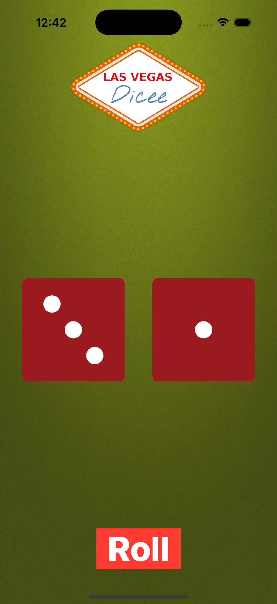

# Dicee - iOS SwiftUI App

A fun SwiftUI dice rolling application. Tap the Roll button to generate two random dice values with a clean, animated interface and a themed background.

## Screenshots

## Features

- **SwiftUI Interface**: Fully built using SwiftUI
- **Two Dice**: Displays two dice side-by-side
- **Random Roll**: Tap Roll to randomize both dice (1–6)
- **Custom Theme**: Background image and Dicee logo
- **Simple State**: Uses `@State` for reactive UI updates

## How It Works

1. **Launch App**: App renders `ContentView` from `Dicee_SwiftUIApp`
2. **View Dice**: Two dice images reflect current state values
3. **Roll Dice**: Tapping Roll updates both dice using `Int.random(in: 1...6)`
4. **SwiftUI Preview**: Live previews available in Xcode

## Technical Details

- **Platform**: iOS 13+
- **Language**: Swift
- **Framework**: SwiftUI
- **Architecture**: SwiftUI App lifecycle with `@main`
- **Target**: iPhone (Portrait orientation)

## Setup Instructions

1. Open `Dicee-SwiftUI.xcodeproj` in Xcode
2. Select your target device or simulator
3. Build and run the project (⌘+R)

## Requirements

- Xcode 12.0 or later
- iOS 13.0 or later
- Swift 5.0 or later

## About

This project is part of a Udemy iOS development course. It demonstrates:
- SwiftUI state management with `@State`
- View composition and layout
- Asset usage and theming

## Author

Created by Ahmet Büyükçelik as part of iOS development learning journey.

---

*Roll the dice with SwiftUI! 🎲*
