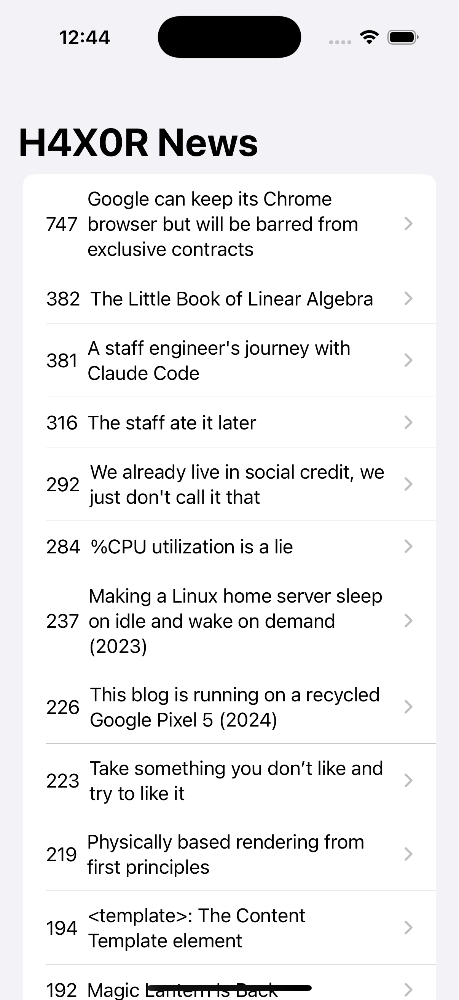

# H4X0R News - iOS SwiftUI App

A SwiftUI Hacker News client that fetches top stories from the HN Algolia API. Browse the front-page posts, see points, and open articles in an in-app web view.

## Screenshots

  
  

## Features

- **SwiftUI Interface**: Built with modern SwiftUI views
- **Top Stories**: Loads Hacker News front-page posts
- **Points + Titles**: Displays score and headline
- **In-App Browser**: Opens articles in a WKWebView
- **ObservableObject**: Live updates via `@Published` posts

## How It Works

1. **Launch App**: `ContentView` creates and observes `NetworkManager`
2. **Fetch Data**: `NetworkManager` requests HN API (`front_page`)
3. **List Posts**: SwiftUI `List` renders posts with NavigationLinks
4. **Open Article**: Detail view hosts a `WebView` for the URL

## Technical Details

- **Platform**: iOS 13+
- **Language**: Swift
- **Framework**: SwiftUI + WebKit
- **Architecture**: SwiftUI App lifecycle with `@main`
- **Networking**: URLSession + JSONDecoder
- **Target**: iPhone (Portrait orientation)

## Setup Instructions

1. Open `H4X0R News.xcodeproj` in Xcode
2. Select your target device or simulator
3. Build and run the project (⌘+R)

## Requirements

- Xcode 12.0 or later
- iOS 13.0 or later
- Swift 5.0 or later

## About

This project is part of a Udemy iOS development course. It demonstrates:
- SwiftUI with ObservableObject and @Published
- Networking with URLSession and Codable
- Web content rendering with WKWebView via UIViewRepresentable

## Author

Created by Ahmet Büyükçelik as part of iOS development learning journey.

---

*Stay up to date with Hacker News in SwiftUI! 🗞️*
