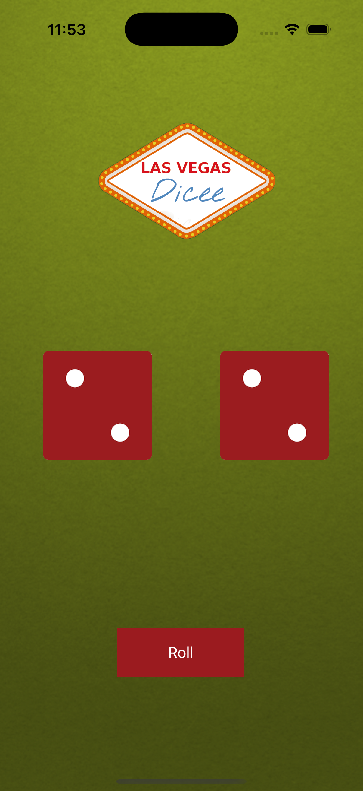

# Dicee - iOS Dice Rolling App

A fun and interactive iOS application that simulates rolling two dice. Tap the "Roll" button to get random dice combinations and enjoy the classic dice rolling experience on your iPhone.

## Screenshots

## Features

- **Two Dice Display**: Shows two dice side by side
- **Random Rolling**: Tap the "Roll" button to get random dice combinations (1-6)
- **Beautiful UI**: Green background with dice logo and modern design
- **Smooth Animation**: Clean dice image transitions
- **Responsive Design**: Optimized for iPhone screens

## How It Works

1. Launch the app to see two dice showing "1"
2. Tap the "Roll" button to generate random dice values
3. Watch as both dice change to random numbers (1-6)
4. Keep rolling for endless fun!

## Technical Details

- **Platform**: iOS 13+
- **Language**: Swift
- **Framework**: UIKit
- **Architecture**: Storyboard-based UI with IBOutlets and IBActions
- **Target**: iPhone
- **Random Generation**: Uses `Int.random(in: 0...5)` for dice values

## Setup Instructions

1. Open `Dicee-iOS13.xcodeproj` in Xcode
2. Select your target device or simulator
3. Build and run the project (⌘+R)
4. Tap "Roll" to start playing!

## Requirements

- Xcode 12.0 or later
- iOS 13.0 or later
- Swift 5.0 or later

## About

This project is part of a Udemy iOS development course. It demonstrates:
- Storyboard UI design
- IBOutlet and IBAction connections
- Random number generation
- Image view manipulation
- Basic iOS app structure

## Author

Created by Ahmet Büyükçelik as part of iOS development learning journey.

---

*Roll the dice and have fun! 🎲🎲*
