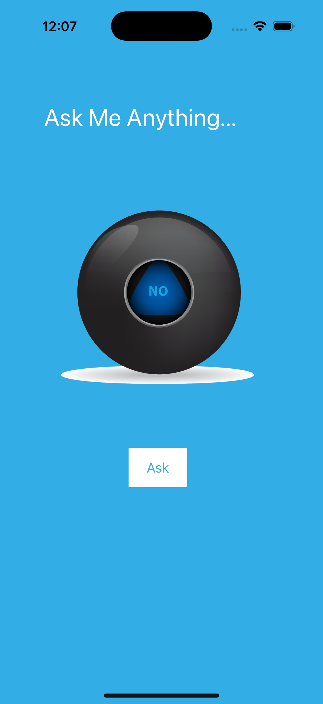

# Magic 8 Ball - iOS Fortune Telling App

A mystical iOS application that simulates the classic Magic 8 Ball experience. Ask any question and tap the "Ask" button to receive a random fortune from the magical ball!

## Screenshots

## Features

- **Fortune Telling**: Ask any question and get a random answer
- **5 Different Ball States**: Multiple ball images with different fortune responses
- **Simple Interface**: Clean design with "Ask Me Anything..." prompt
- **One-Tap Fortune**: Just tap "Ask" to get your fortune
- **Mystical Design**: Cyan background with white text for a magical feel

## How It Works

1. Launch the app to see the Magic 8 Ball interface
2. Think of a question you want answered
3. Tap the "Ask" button
4. Watch as the ball changes to reveal your fortune
5. Ask as many questions as you want!

## Technical Details

- **Platform**: iOS 13+
- **Language**: Swift
- **Framework**: UIKit
- **Architecture**: Storyboard-based UI with IBOutlets and IBActions
- **Target**: iPhone
- **Random Selection**: Uses `randomElement()` to pick from 5 ball images

## Setup Instructions

1. Open `Magic 8 Ball.xcodeproj` in Xcode
2. Select your target device or simulator
3. Build and run the project (⌘+R)
4. Tap "Ask" to get your fortune!

## Requirements

- Xcode 12.0 or later
- iOS 13.0 or later
- Swift 5.0 or later

## About

This project is part of a Udemy iOS development course. It demonstrates:
- Storyboard UI design
- IBOutlet and IBAction connections
- Random element selection from arrays
- Image literal usage
- Simple user interaction patterns

## Author

Created by Ahmet Büyükçelik as part of iOS development learning journey.

---

*Ask the Magic 8 Ball anything! 🔮✨*
