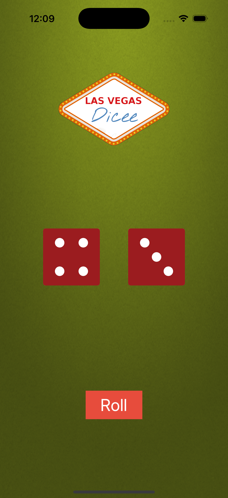

# AutoLayout Dicee - iOS Responsive Design App

An advanced iOS dice rolling application that demonstrates AutoLayout constraints and responsive design principles. This project showcases how to create adaptive UIs that work across different screen sizes and orientations using Stack Views and Auto Layout.

## Screenshots

## Features

- **Responsive Design**: Uses AutoLayout constraints for all screen sizes
- **Stack View Layout**: Vertical and horizontal stack views for organized UI
- **Three-Section Layout**: Top (logo), Middle (dice), Bottom (button) sections
- **Equal Distribution**: Each section takes equal space using `fillEqually`
- **Centered Elements**: All UI elements are perfectly centered
- **Adaptive Spacing**: 50pt spacing between dice elements
- **Constraint-Based**: No fixed frames, everything uses constraints

## How It Works

1. **Top Section**: Contains the Dicee logo, centered both horizontally and vertically
2. **Middle Section**: Features two dice side by side with 50pt spacing
3. **Bottom Section**: Houses the "Roll" button, centered in its section
4. **Roll Action**: Tap "Roll" to get random dice combinations (1-6)
5. **Responsive**: Layout adapts to different screen sizes automatically

## Technical Details

- **Platform**: iOS 13+
- **Language**: Swift
- **Framework**: UIKit
- **Layout System**: AutoLayout with Stack Views
- **Architecture**: Storyboard-based UI with constraints
- **Target**: iPhone (all sizes)
- **Random Generation**: Uses `Int.random(in: 0...5)` for dice values

## AutoLayout Features Demonstrated

- **Vertical Stack View**: Main container with `fillEqually` distribution
- **Horizontal Stack View**: Dice container with 50pt spacing
- **Center Constraints**: All elements centered in their containers
- **Safe Area**: Respects safe area layout guides
- **Equal Heights**: Three sections with equal height distribution
- **Aspect Ratio**: Dice images maintain proper aspect ratio

## Setup Instructions

1. Open `AutoLayout-iOS13.xcodeproj` in Xcode
2. Select your target device or simulator
3. Build and run the project (⌘+R)
4. Test on different screen sizes to see responsive behavior
5. Tap "Roll" to get random dice combinations!

## Requirements

- Xcode 12.0 or later
- iOS 13.0 or later
- Swift 5.0 or later

## About

This project is part of a Udemy iOS development course. It demonstrates:
- AutoLayout constraint system
- Stack View usage and configuration
- Responsive design principles
- Safe area layout guides
- Equal distribution layouts
- Centering techniques

## Author

Created by Ahmet Büyükçelik as part of iOS development learning journey.

---

*Master AutoLayout with this responsive dice app! 🎲📱*
