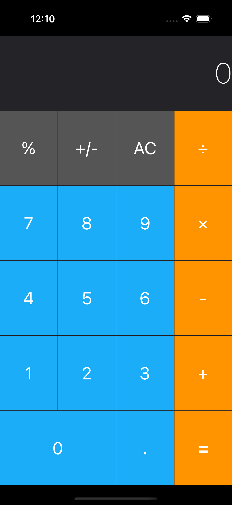

# Calculator Layout - iOS Calculator UI Design

A comprehensive iOS calculator layout project that demonstrates advanced AutoLayout techniques and complex UI design patterns. This project showcases how to create a professional calculator interface using Stack Views, constraints, and responsive design principles.

## Screenshots

## Features

- **Complete Calculator Layout**: Full calculator interface with display and buttons
- **Landscape Orientation**: Optimized for landscape mode like real calculators
- **Stack View Architecture**: Nested vertical and horizontal stack views
- **Color-Coded Buttons**: Different colors for different button types
- **Responsive Design**: Adapts to different screen sizes
- **Professional UI**: Clean, modern calculator design
- **Equal Distribution**: All buttons properly sized and spaced

## Layout Structure

### Display Area
- **Large Display**: Shows "0" with right-aligned text
- **Thin Font**: Uses system thin font at 50pt
- **White Text**: High contrast on dark background

### Button Layout (5 Rows)
1. **Row 1**: %, +/-, AC, ÷ (Gray and Orange buttons)
2. **Row 2**: 7, 8, 9, × (Blue and Orange buttons)
3. **Row 3**: 4, 5, 6, - (Blue and Orange buttons)
4. **Row 4**: 1, 2, 3, + (Blue and Orange buttons)
5. **Row 5**: 0 (double width), ., = (Blue and Orange buttons)

## Technical Details

- **Platform**: iOS 13+
- **Language**: Swift
- **Framework**: UIKit
- **Layout System**: AutoLayout with nested Stack Views
- **Architecture**: Storyboard-based UI with constraints
- **Target**: iPhone (Landscape orientation)
- **Button Types**: System buttons with custom colors

## AutoLayout Features Demonstrated

- **Nested Stack Views**: Vertical main stack with horizontal button rows
- **Fill Equally**: Equal distribution of buttons in each row
- **Double Width Button**: "0" button spans two columns
- **Safe Area**: Respects safe area layout guides
- **Equal Heights**: All rows have equal height distribution
- **Consistent Spacing**: 1pt spacing between all elements

## Color Scheme

- **Display Background**: Black
- **Number Buttons**: Blue (#1C9BEF)
- **Operation Buttons**: Orange (#FF9400)
- **Function Buttons**: Gray (#555555)
- **Text Color**: White for all buttons

## Setup Instructions

1. Open `Calculator Layout iOS13.xcodeproj` in Xcode
2. Select your target device or simulator
3. Build and run the project (⌘+R)
4. Rotate to landscape mode to see full calculator layout
5. Note: This is a layout-only project (no functionality)

## Requirements

- Xcode 12.0 or later
- iOS 13.0 or later
- Swift 5.0 or later

## About

This project is part of a Udemy iOS development course. It demonstrates:
- Complex AutoLayout constraint systems
- Nested Stack View usage
- Professional UI design patterns
- Landscape orientation optimization
- Color scheme implementation
- Button layout and spacing

## Author

Created by Ahmet Büyükçelik as part of iOS development learning journey.

---

*Master complex layouts with this calculator design! 🧮📱*
