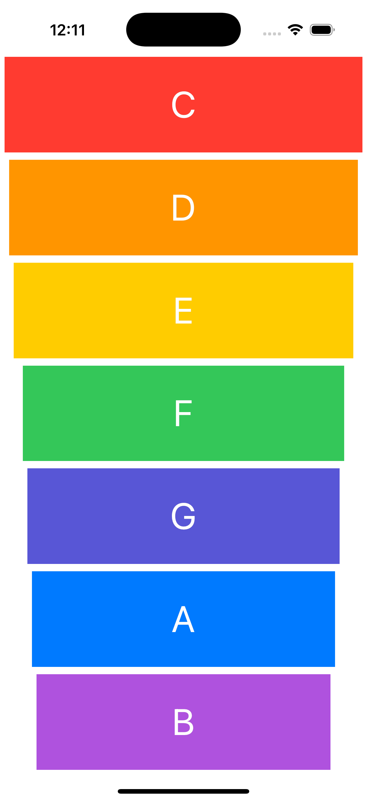

# Xylophone - iOS Musical Instrument App

An interactive iOS xylophone application that plays musical notes when you tap the colorful keys. This project demonstrates audio playback, visual feedback, and advanced AutoLayout techniques with a beautiful musical interface.

## Screenshots

## Features

- **7 Musical Keys**: C, D, E, F, G, A, B notes with corresponding sounds
- **Audio Playback**: Plays WAV audio files for each note
- **Visual Feedback**: Keys dim when pressed and return to normal
- **Colorful Design**: Each key has a different system color
- **Responsive Layout**: AutoLayout with Stack Views for all screen sizes
- **Smooth Animation**: 0.2-second fade effect on key press
- **Realistic Xylophone**: Keys get progressively narrower (like a real xylophone)

## How It Works

1. **Tap Any Key**: Each colored key plays a different musical note
2. **Visual Feedback**: Key dims to 50% opacity when pressed
3. **Audio Playback**: Corresponding WAV file plays immediately
4. **Auto Recovery**: Key returns to full opacity after 0.2 seconds
5. **Create Music**: Play melodies by tapping keys in sequence

## Technical Details

- **Platform**: iOS 13+
- **Language**: Swift
- **Framework**: UIKit + AVFoundation
- **Audio System**: AVAudioPlayer for sound playback
- **Layout System**: AutoLayout with Stack Views
- **Architecture**: Storyboard-based UI with IBActions
- **Target**: iPhone (Portrait orientation)

## Audio Features

- **WAV Files**: High-quality audio files for each note
- **Bundle Resources**: Audio files stored in app bundle
- **Instant Playback**: No delay when tapping keys
- **Memory Efficient**: Audio player created on-demand

## Key Layout (Top to Bottom)

1. **C Key**: Red - Widest key (5pt margins)
2. **D Key**: Orange - Slightly narrower (10pt margins)
3. **E Key**: Yellow - Medium width (15pt margins)
4. **F Key**: Green - Narrower (25pt margins)
5. **G Key**: Indigo - Even narrower (30pt margins)
6. **A Key**: Blue - Narrow (35pt margins)
7. **B Key**: Purple - Narrowest (40pt margins)

## Setup Instructions

1. Open `Xylophone.xcodeproj` in Xcode
2. Select your target device or simulator
3. Build and run the project (⌘+R)
4. Tap the colorful keys to play music!
5. Try playing simple melodies like "Twinkle Twinkle Little Star"

## Requirements

- Xcode 12.0 or later
- iOS 13.0 or later
- Swift 5.0 or later
- Device with speakers (for audio playback)

## About

This project is part of a Udemy iOS development course. It demonstrates:
- Audio playback with AVFoundation
- Visual feedback and animations
- Complex AutoLayout with Stack Views
- Bundle resource management
- Asynchronous programming with DispatchQueue
- Interactive UI design

## Author

Created by Ahmet Büyükçelik as part of iOS development learning journey.

---

*Play beautiful music with your virtual xylophone! 🎵🎹*
