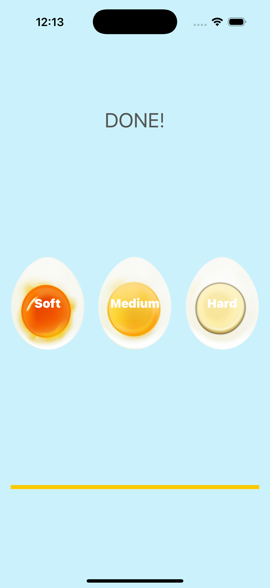

# EggTimer - iOS Timer App

A practical iOS timer application for cooking eggs to perfection. Choose your preferred egg hardness (Soft, Medium, Hard) and watch the progress bar fill as the timer counts down. Perfect for achieving the ideal egg consistency every time!

## Screenshots

## Features

- **Three Egg Types**: Soft (3 min), Medium (4 min), Hard (7 min)
- **Visual Progress Bar**: Real-time countdown with yellow progress indicator
- **Audio Alert**: Alarm sound when timer completes
- **Interactive UI**: Tap egg images to start different timers
- **Dynamic Labels**: Title changes to show current selection and "DONE!" when complete
- **Timer Management**: Automatic timer invalidation and reset functionality
- **Beautiful Design**: Clean interface with egg images and soft blue background

## How It Works

1. **Choose Hardness**: Tap on Soft, Medium, or Hard egg image
2. **Timer Starts**: Progress bar begins filling from 0% to 100%
3. **Real-time Updates**: Progress bar updates every second
4. **Completion Alert**: Alarm sounds and "DONE!" appears when timer finishes
5. **Reset Ready**: Tap another egg to start a new timer

## Timer Durations

- **Soft Egg**: 3 minutes (180 seconds)
- **Medium Egg**: 4 minutes (240 seconds)  
- **Hard Egg**: 7 minutes (420 seconds)

## Technical Details

- **Platform**: iOS 13+
- **Language**: Swift
- **Framework**: UIKit + AVFoundation
- **Timer System**: NSTimer with 1-second intervals
- **Audio System**: AVAudioPlayer for alarm sound
- **Layout System**: AutoLayout with Stack Views
- **Architecture**: Storyboard-based UI with IBActions
- **Target**: iPhone (Portrait orientation)

## Key Code Features

- **Timer Management**: `Timer.scheduledTimer()` for countdown
- **Progress Calculation**: `Float(secondsPassed) / Float(totalTime)`
- **Audio Playback**: MP3 alarm sound when complete
- **State Management**: Timer invalidation and reset
- **Dynamic UI**: Label text updates based on state
- **Memory Management**: Proper timer cleanup

## Setup Instructions

1. Open `EggTimer.xcodeproj` in Xcode
2. Select your target device or simulator
3. Build and run the project (⌘+R)
4. Tap an egg to start the timer!
5. Wait for the alarm and enjoy your perfectly cooked egg

## Requirements

- Xcode 12.0 or later
- iOS 13.0 or later
- Swift 5.0 or later
- Device with speakers (for alarm sound)

## About

This project is part of a Udemy iOS development course. It demonstrates:
- Timer programming with NSTimer
- Progress bar implementation
- Audio playback with AVFoundation
- State management and UI updates
- AutoLayout with Stack Views
- Practical app development

## Author

Created by Ahmet Büyükçelik as part of iOS development learning journey.

---

*Cook perfect eggs every time! 🥚⏰*
