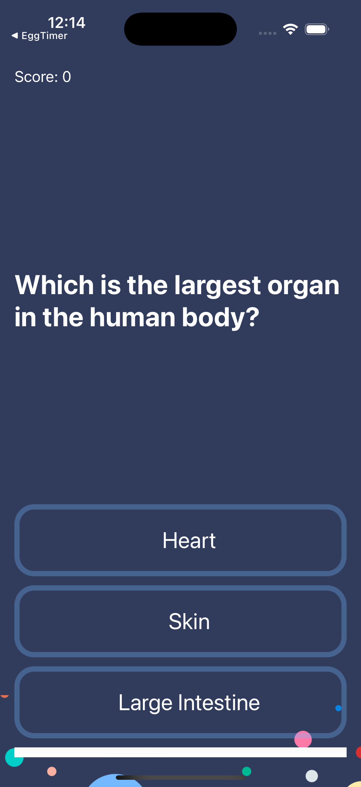
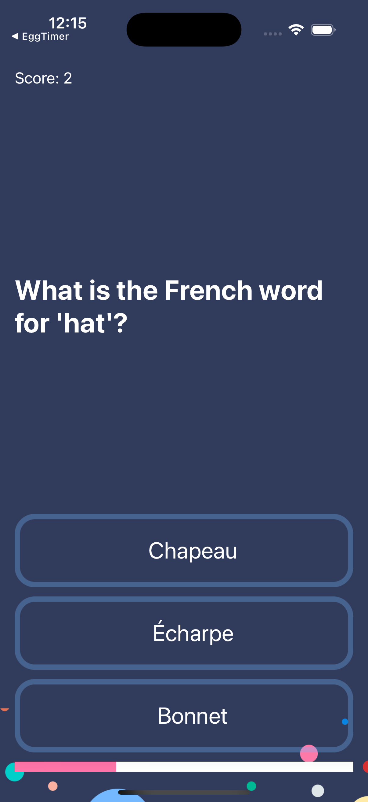

# Quizzler - iOS Quiz App

An interactive iOS quiz application that tests your knowledge with multiple-choice questions. Built using MVC (Model-View-Controller) architecture, this app features a beautiful UI, score tracking, and progress indication.

## Screenshots

## Features

- **10 Quiz Questions**: Diverse questions covering various topics
- **Multiple Choice**: Three answer options for each question
- **Score Tracking**: Real-time score display and updates
- **Progress Bar**: Visual progress indicator showing quiz completion
- **Instant Feedback**: Buttons turn green (correct) or red (incorrect)
- **Auto-Reset**: Quiz automatically restarts after completion
- **Beautiful UI**: Dark theme with bubble background and modern design
- **MVC Architecture**: Clean separation of concerns

## How It Works

1. **Start Quiz**: App loads with the first question
2. **Answer Questions**: Tap one of three answer choices
3. **Get Feedback**: Button turns green (correct) or red (incorrect)
4. **Track Progress**: Score updates and progress bar advances
5. **Continue**: Next question loads automatically after 0.2 seconds
6. **Complete**: Quiz restarts when all questions are answered

## Technical Details

- **Platform**: iOS 13+
- **Language**: Swift
- **Framework**: UIKit
- **Architecture**: MVC (Model-View-Controller)
- **Layout System**: AutoLayout with Stack Views
- **Target**: iPhone (Portrait orientation)

## Setup Instructions

1. Open `Quizzler-iOS13.xcodeproj` in Xcode
2. Select your target device or simulator
3. Build and run the project (⌘+R)
4. Start answering questions and test your knowledge!

## Requirements

- Xcode 12.0 or later
- iOS 13.0 or later
- Swift 5.0 or later

## About

This project is part of a Udemy iOS development course. It demonstrates:
- MVC (Model-View-Controller) architecture
- Struct-based data modeling
- Timer-based UI updates
- Progress tracking and score management
- AutoLayout with Stack Views
- Clean code organization

## Author

Created by Ahmet Büyükçelik as part of iOS development learning journey.

---

*Test your knowledge with this interactive quiz! 🧠📱*
