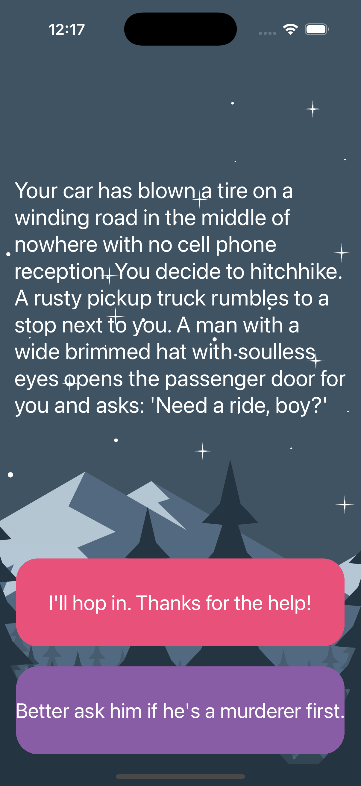
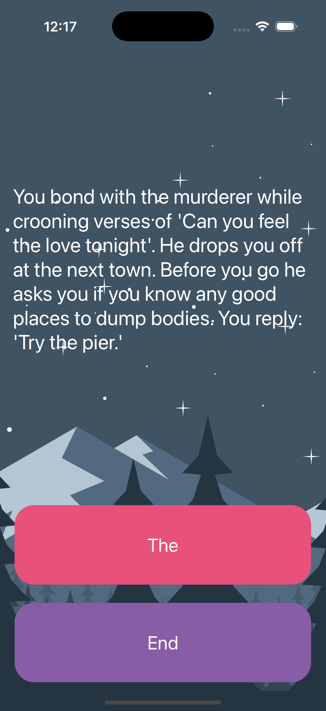

# Destini - iOS Interactive Story App

An engaging iOS interactive story application where your choices determine the outcome of the adventure. Navigate through a thrilling narrative with multiple story paths and different endings based on your decisions.

## Screenshots

  
  

## Features

- **Interactive Storytelling**: Your choices shape the narrative
- **Multiple Story Paths**: Different routes lead to various endings
- **Thrilling Adventure**: Suspenseful story about a hitchhiking adventure
- **Beautiful UI**: Dark theme with custom background and button designs
- **MVC Architecture**: Clean separation of story logic and presentation
- **Dynamic Content**: Story text and choices update based on your decisions
- **Immersive Experience**: Full-screen story with engaging visuals

## How It Works

1. **Start Adventure**: App begins with the opening story scenario
2. **Read Story**: Large text area displays the current story segment
3. **Make Choices**: Tap one of two choice buttons to continue
4. **Navigate Paths**: Your choice determines the next story segment
5. **Reach Endings**: Different choices lead to different conclusions
6. **Restart**: Story resets to beginning when completed

## Technical Details

- **Platform**: iOS 13+
- **Language**: Swift
- **Framework**: UIKit
- **Architecture**: MVC (Model-View-Controller)
- **Layout System**: AutoLayout with Stack Views
- **Target**: iPhone (Portrait orientation)

## Setup Instructions

1. Open `Destini-iOS13.xcodeproj` in Xcode
2. Select your target device or simulator
3. Build and run the project (⌘+R)
4. Start your adventure and make choices!

## Requirements

- Xcode 12.0 or later
- iOS 13.0 or later
- Swift 5.0 or later

## About

This project is part of a Udemy iOS development course. It demonstrates:
- Interactive storytelling mechanics
- MVC architecture with data modeling
- Dynamic UI updates based on user choices
- Story state management
- AutoLayout with custom backgrounds
- User experience design

## Author

Created by Ahmet Büyükçelik as part of iOS development learning journey.

---

*Choose your own adventure! 🚗📖*
